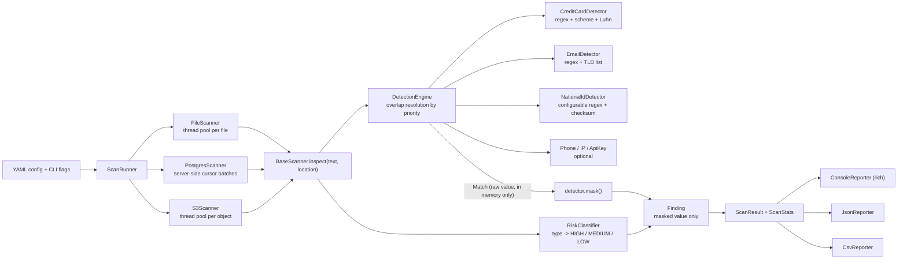

# Data Discovery & Classification Scanner

[](https://github.com/holego/data-classification-scanner/actions/workflows/ci.yml)


A command-line tool that scans **files, PostgreSQL tables and AWS S3 objects** for sensitive
data (payment cards, national IDs, e-mail addresses, phone numbers, IP addresses, API keys and
tokens), classifies every finding by data type and risk level, and reports it **without ever
writing the sensitive value itself** to a report or a log.

It is a small, readable model of what a Data Loss Prevention (DLP) discovery engine does.

## Why this exists

Data security programmes start with a question most organisations cannot answer: *where is our
sensitive data?* Card numbers end up in support-ticket text, SSNs in CSV exports, API keys in
deploy notes, e-mail addresses in application logs. Access controls, encryption and retention
policies can only protect data that has been found first. Commercial DLP and data-discovery
products (Macie, Purview, BigID, ...) do this at scale; this project implements the same core
loop in a form that is easy to read, test and extend:

```
enumerate sources -> read content -> detect + validate -> classify -> mask -> report
```

Design goals, in order: **few false positives** (a scanner nobody trusts gets switched off),
**no new exposure** (the tool must not become a second copy of the data it hunts), and
**modularity** (new sources, detectors and report formats plug in without touching the rest).

## Features

- **Three sources** behind one `BaseScanner` interface: local filesystem (recursive; `.txt`,
  `.csv`, `.json`, `.log`, `.sql`), PostgreSQL (table/column level, batched over server-side
  cursors), AWS S3 (bucket + prefix, streamed).
- **Validated detection**: card numbers need a known scheme prefix *and* a Luhn checksum;
  e-mail domains are checked against the IANA TLD list; national IDs are structurally
  validated (SSN rules, checksums for CA/RU/PL/BR IDs). Optional detectors for phone numbers,
  IP addresses, provider API keys (AWS, GitHub, Slack, Stripe, Google, JWT, PEM headers) and
  generic high-entropy secrets.
- **Configurable national IDs**: pick built-in country profiles or add your own regex,
  checksum validator and context keywords in YAML.
- **Risk classification**: HIGH (cards, national IDs, secrets), MEDIUM (e-mail, phone),
  LOW (IP); every level is overridable per data type or subtype.
- **Parallel by design**: `concurrent.futures` with bounded queueing for files, S3 objects and
  tables (threads by default, an optional process pool for CPU-bound local scans); batched,
  server-side-cursor fetches for databases.
- **Safe output**: console (colour by risk), JSON and CSV. Values are masked
  (`**** **** **** 1111`) at the moment of detection; the raw value has no place to live in the
  result model.
- **Allowlists** for paths, S3 keys, tables and columns; `--dry-run` to see what would be read.
- **CI-friendly**: `--fail-on high` returns a distinct exit code.
- Credentials only from the environment / AWS credentials chain, never from the config file.

## Architecture



| Layer | Package | Contract | Implementations |
|---|---|---|---|
| Detectors | `src/detectors/` | `BaseDetector.detect(text) -> Match`, `.mask(value) -> str` | credit card, e-mail, national ID, phone, IP, API key |
| Scanners | `src/scanners/` | `BaseScanner.plan()` / `.scan() -> Finding` | file, PostgreSQL, S3 |
| Classifiers | `src/classifiers/` | `classify(data_type, subtype) -> (risk, category)` | `RiskClassifier` |
| Reporters | `src/reporters/` | `BaseReporter.report(ScanResult)` | console, JSON, CSV |

Supporting modules: `config.py` (YAML loading and validation), `allowlist.py` (glob matchers),
`runner.py` (wiring), `logging_utils.py` (redacting log formatter), `cli.py` (click CLI).
The import package is `dcscanner`; its sources live in `src/` (see `[tool.setuptools]` in
`pyproject.toml`).

**Extending it**

- *New detector*: subclass `BaseDetector` (or `RegexDetector`), implement `detect` and `mask`,
  add it to `detectors/registry.py`. Nothing else changes.
- *New source*: subclass `BaseScanner`; read your source, call `self.inspect(text, source, ...)`
  for each text unit, and yield the findings.
- *New format*: subclass `BaseReporter`.

## Installation

Requires Python 3.10+.

```bash
git clone https://github.com/holego/data-classification-scanner.git
cd data-classification-scanner
python3 -m venv .venv && source .venv/bin/activate
pip install -e ".[dev]"        # scanner + test dependencies (pytest, moto, Faker)
scanner --help
```

`requirements.txt` / `requirements-dev.txt` list the same dependencies for environments that
install from requirement files; the package itself still needs `pip install -e .` (or
`pip install .`) to provide the `scanner` command.

### Credentials

Nothing secret is ever read from the YAML config (a config that contains `password`,
`secret_access_key`, `token`, `dsn`, ... under `sources` is rejected).

**PostgreSQL** uses the standard libpq variables. Copy `.env.example` to `.env` (git-ignored;
the CLI loads `./.env` from the current directory, and real environment variables win) or export them:

```bash
export PGHOST=localhost PGPORT=5432 PGDATABASE=scanner_demo PGUSER=scanner PGPASSWORD=...
```

The scanner opens the connection **read-only**. Give it a dedicated role with `SELECT` on
just the tables to scan:

```sql
CREATE ROLE scanner LOGIN PASSWORD '...';
GRANT CONNECT ON DATABASE app TO scanner;
GRANT USAGE ON SCHEMA public TO scanner;
GRANT SELECT ON public.users, public.orders TO scanner;
```

**AWS S3** uses the default boto3 credentials chain: `AWS_PROFILE` / `~/.aws/credentials`,
SSO, `AWS_ACCESS_KEY_ID`/`AWS_SECRET_ACCESS_KEY` (+ `AWS_SESSION_TOKEN`), or an instance /
container / IRSA role. Prefer profiles or roles over static keys. Least privilege is a
read-only policy:

```json
{
  "Version": "2012-10-17",
  "Statement": [
    { "Effect": "Allow", "Action": "s3:ListBucket", "Resource": "arn:aws:s3:::my-bucket" },
    { "Effect": "Allow", "Action": "s3:GetObject", "Resource": "arn:aws:s3:::my-bucket/uploads/*" }
  ]
}
```

## Quick start with synthetic data

Everything below uses fabricated data produced by [Faker](https://faker.readthedocs.io/)
(fixed seed, reserved `example.*` e-mail domains, fictional `555-01xx` phone numbers). No real
personal data is involved anywhere in this repository.

```bash
python scripts/seed_test_data.py files --out sample_data      # 8 files in ./sample_data
scanner scan --source file --path ./sample_data
```

### Test PostgreSQL with docker-compose

```bash
cp .env.example .env                       # adjust PGPASSWORD if you like
docker compose --env-file .env -f docker/docker-compose.yml up -d --build postgres seed
docker compose --env-file .env -f docker/docker-compose.yml logs seed
# seeded PostgreSQL with 200 users and related tables

scanner scan --source postgres --table users --columns email,card_number
```

The `seed` service creates four tables (`users`, `orders`, `support_tickets`, `audit_log`) and
fills them with Faker data. The database is published on `127.0.0.1` only. You can also run
the scanner itself in a container, with the config and sample data mounted:

```bash
export LOCAL_UID=$(id -u) LOCAL_GID=$(id -g)      # so ./reports stays writable
docker compose --env-file .env -f docker/docker-compose.yml run --rm scanner \
    scan --source postgres --table users --columns email,card_number
```

### Test S3 without an AWS account

A [moto](https://github.com/getmoto/moto) server stands in for S3. Either use the compose
profile (`AWS_ACCESS_KEY_ID`/`AWS_SECRET_ACCESS_KEY` may be any dummy values for the mock):

```bash
export AWS_ACCESS_KEY_ID=dummy AWS_SECRET_ACCESS_KEY=dummy AWS_DEFAULT_REGION=us-east-1
docker compose --env-file .env -f docker/docker-compose.yml --profile s3 up -d s3 seed-s3
AWS_ENDPOINT_URL=http://localhost:5000 scanner scan --source s3 --bucket demo-bucket --prefix uploads/
```

or run the mock directly from the dev dependencies:

```bash
moto_server -p 5000 &
export AWS_ENDPOINT_URL=http://localhost:5000
python scripts/seed_test_data.py s3 --bucket demo-bucket --prefix uploads/
scanner scan --source s3 --bucket demo-bucket --prefix uploads/
```

Against real AWS simply omit `AWS_ENDPOINT_URL` and use your normal credentials.

## Usage

```
scanner scan --source file --path ./data
scanner scan --source postgres --table users --columns email,card_number --config db.yaml
scanner scan --source s3 --bucket my-bucket --prefix uploads/
scanner scan --all --config scan_config.yaml
```

| Flag | Meaning |
|---|---|
| `--source file\|postgres\|s3` | Source to scan (repeatable). |
| `--all` | Scan every source that has `enabled: true` in `--config`. |
| `--config FILE` | YAML configuration ([example](config/scan_config.example.yaml)). CLI flags override it. |
| `--path PATH` | File or directory (repeatable). |
| `--table T`, `--columns a,b`, `--schema S` | PostgreSQL target. `--table` accepts `schema.table` and repeats; without `--columns` every text-like column is scanned. |
| `--bucket B`, `--prefix P` | S3 target; the prefix works like a folder. |
| `--detectors a,b` | Run only these detectors (`scanner detectors` lists them). |
| `--output console\|json\|csv` (`-o`) | Output format, repeatable. Default `console`. |
| `--report-dir D`, `--report-name N` | Where JSON/CSV files go (default `./reports/scan-report-<timestamp>.<ext>`). |
| `--threads N` | Workers for files, S3 objects and tables. |
| `--executor thread\|process` | Pool type for **local files**: `thread` (default) or `process` to spread the regex work over several cores. See [Design decisions](#other-choices-worth-knowing). |
| `--dry-run` | List what would be scanned. Reads no file or object content and runs no table queries (S3 keys are listed; PostgreSQL is not contacted). |
| `--fail-on low\|medium\|high` | Exit `3` if a finding at or above that risk exists. |
| `--max-rows N` | Rows in the console table (default 200, `0` = all). |
| `-v`, `-vv` | INFO / DEBUG logs on stderr (always masked). |

Exit codes: `0` clean, `1` a source failed or errors occurred (incomplete coverage),
`2` usage or configuration error, `3` findings at or above `--fail-on`.

### Configuration

[`config/scan_config.example.yaml`](config/scan_config.example.yaml) documents every option.
The interesting parts:

```yaml
detectors:
  national_id:
    profiles: [us_ssn, uk_nino]          # built-in: us_ssn ca_sin uk_nino ru_inn ru_snils pl_pesel br_cpf
    custom_patterns:                     # any other country: your own regex
      - name: de_steuer_id
        regex: '(?<!\d)\d{2} ?\d{3} ?\d{3} ?\d{3}(?!\d)'
        keep_last: 3                     # characters left visible in the mask
        context_keywords: [steuer-id]    # bare digit strings only count near a keyword
classification:
  risk_levels:
    email: HIGH                          # override a type ...
    national_id.uk_nino: MEDIUM          # ... or a single subtype
sources:
  postgres:
    batch_size: 1000
    tables:
      - name: users
        columns: [email, ssn, card_number]
      - name: support_tickets            # no columns: every text/json column
allowlist:
  paths: ["**/node_modules/**", "*.min.json"]
  tables: [audit_log]
  columns: ["*.password_hash"]
  s3_keys: ["archive/**"]
```

## Examples (real output on the synthetic data)

**Filesystem.** `customers.csv` findings carry the CSV header as the column name.

```text
 Risk     Type                     Source                      Line:Col / Row      Value (masked)
 ─────────────────────────────────────────────────────────────────────────────────────────────────────
  HIGH    credit_card (visa)       sample_data/customers.csv   2:1 [card_number]   **** **** **** 9407
  HIGH    national_id (us_ssn)     sample_data/customers.csv   2:1 [ssn]           ***-**-0521
  HIGH    credit_card (discover)   sample_data/customers.csv   3:1 [card_number]   **** **** **** 1035
  HIGH    national_id (us_ssn)     sample_data/customers.csv   3:1 [ssn]           ***-**-7528
  HIGH    credit_card (discover)   sample_data/customers.csv   4:1 [card_number]   **** **** **** 5039
  HIGH    national_id (us_ssn)     sample_data/customers.csv   4:1 [ssn]           ***-**-1170
  HIGH    credit_card (diners)     sample_data/customers.csv   5:1 [card_number]   **** ****** 8713
  HIGH    national_id (us_ssn)     sample_data/customers.csv   5:1 [ssn]           ***-**-4041

... 383 more finding(s) not shown (use --max-rows 0 or --output json/csv for the full list)
──────────────────────────────────────────────── Scan summary ────────────────────────────────────────────────
Sources:   file
Duration:  0.03s
Scanned:   8 files, 537 lines, 26.7 KB
Findings:  391 total   HIGH 215    MEDIUM 176

 Data type     Findings
 ──────────────────────
 email              176
 credit_card        112
 national_id        100
 api_key              3
```

**PostgreSQL.** Coordinates are the table row and, when the primary key is an integer or UUID,
its value; the source is `schema.table.column`.

```text
 Risk     Type                     Source                     Line:Col / Row             Value (masked)
 ───────────────────────────────────────────────────────────────────────────────────────────────────────────
  HIGH    credit_card (visa)       public.users.card_number   row 1 id=1 [card_number]   **** **** **** 9407
  HIGH    credit_card (discover)   public.users.card_number   row 2 id=2 [card_number]   **** **** **** 1035
  HIGH    credit_card (discover)   public.users.card_number   row 3 id=3 [card_number]   **** **** **** 5039
  HIGH    credit_card (diners)     public.users.card_number   row 4 id=4 [card_number]   **** ****** 8713
  HIGH    credit_card (diners)     public.users.card_number   row 5 id=5 [card_number]   **** ****** 4825

... 95 more finding(s) not shown (use --max-rows 0 or --output json/csv for the full list)
──────────────────────────────────────────────── Scan summary ────────────────────────────────────────────────
Sources:   postgres
Duration:  0.16s
Scanned:   1 table, 50 rows
Findings:  100 total   HIGH 50    MEDIUM 50

 Data type     Findings
 ──────────────────────
 credit_card         50
 email               50
```

**S3.** Sources are `s3://bucket/key`; the prefix limits the scan like a folder. Secrets show
the well-known prefix (or two characters for generic tokens) and nothing else.

```text
 Risk       Type                            Source                                          Line:Col / Row   Value (masked)
 ───────────────────────────────────────────────────────────────────────────────────────────────────────────────────────────
  HIGH      api_key (aws_access_key_id)     s3://demo-bucket/uploads/ops/deploy_notes.txt   2:21             AKIA********
  HIGH      api_key (high_entropy_string)   s3://demo-bucket/uploads/ops/deploy_notes.txt   3:25             uE********
  HIGH      api_key (high_entropy_string)   s3://demo-bucket/uploads/ops/deploy_notes.txt   4:16             r7********
  MEDIUM    email                           s3://demo-bucket/uploads/ops/deploy_notes.txt   5:16             o**@example.org

─────────────────────────────────────────────────────── Scan summary ────────────────────────────────────────────────────────
Sources:   s3
Duration:  0.30s
Scanned:   1 S3 object, 5 lines, 206 B
Findings:  4 total   HIGH 3    MEDIUM 1

 Data type   Findings
 ────────────────────
 api_key            3
 email              1
```

**Everything in the config at once**, with a JSON report written to `reports/demo.json`
(phone and IP detectors are enabled in the example config, `audit_log` and `clean/**` are
allowlisted):

```text
 Risk     Type                     Source                      Line:Col / Row      Value (masked)
 ─────────────────────────────────────────────────────────────────────────────────────────────────────
  HIGH    credit_card (visa)       sample_data/customers.csv   2:1 [card_number]   **** **** **** 9407
  HIGH    national_id (us_ssn)     sample_data/customers.csv   2:1 [ssn]           ***-**-0521
  HIGH    credit_card (discover)   sample_data/customers.csv   3:1 [card_number]   **** **** **** 1035
  HIGH    national_id (us_ssn)     sample_data/customers.csv   3:1 [ssn]           ***-**-7528

... 803 more finding(s) not shown (use --max-rows 0 or --output json/csv for the full list)
──────────────────────────────────────────────── Scan summary ────────────────────────────────────────────────
Sources:   file, postgres
Duration:  0.14s
Scanned:   6 files, 3 tables, 531 lines, 112 rows, 26.3 KB
Skipped:   1 (allowlisted, binary or over the size limit)
Findings:  807 total   HIGH 320    MEDIUM 387    LOW 100

 Data type     Findings
 ──────────────────────
 email              250
 credit_card        167
 national_id        150
 phone              137
 ip_address         100
 api_key              3

Report written: reports/demo.json
```

**Dry run** lists targets without reading any content:

```text
                        Dry run: would scan

  Source   Target                                    Size   Detail
 ──────────────────────────────────────────────────────────────────
  file     sample_data/customers.csv               5.2 KB
  file     sample_data/support_notes.txt           6.8 KB
  file     sample_data/clean/false_positives.txt    279 B
  file     sample_data/clean/readme.txt             106 B
  file     sample_data/exports/members_dump.sql    1.8 KB
  file     sample_data/exports/orders.json         6.7 KB
  file     sample_data/logs/app.log                5.5 KB
  file     sample_data/ops/deploy_notes.txt         206 B

8 target(s), 26.7 KB - nothing was read.
```

**False positives stay quiet.** `sample_data/clean/false_positives.txt` contains a 16-digit
number that fails Luhn, a timestamp, `logo@2x.png`, `user@host.invalidtld`, a git SHA and two
SSNs the SSA never issues. With every detector enabled:

```text
No sensitive data found.
──────────────────────────────────────────────── Scan summary ────────────────────────────────────────────────
Sources:   file
Duration:  0.00s
Scanned:   2 files, 6 lines, 385 B
Findings:  0 total
```

**As a pipeline gate**: `--fail-on high` turns the scan into a check.

```console
$ scanner scan --source file --path ./sample_data/ops --detectors api_key,email --fail-on high -o console; echo "exit code: $?"
...
exit code: 3
```

### Report formats

JSON (`--output json`) carries scan metadata, a summary and the findings:

```json
{
  "scan": { "tool": "data-classification-scanner", "version": "0.1.0", "duration_seconds": 0.294,
            "dry_run": false, "sources": ["file", "postgres"], "...": "..." },
  "summary": {
    "total_findings": 807,
    "by_risk": { "HIGH": 320, "MEDIUM": 387, "LOW": 100 },
    "by_type": { "email": 250, "credit_card": 167, "national_id": 150, "phone": 137, "ip_address": 100, "api_key": 3 },
    "scanned": { "files_scanned": 6, "lines_scanned": 531, "tables_scanned": 3, "rows_scanned": 112, "...": "..." }
  },
  "findings": [
    {
      "source_type": "file",
      "source": "sample_data/customers.csv",
      "data_type": "credit_card",
      "subtype": "visa",
      "category": "PCI",
      "risk": "HIGH",
      "location": { "line": 2, "offset": 1, "column_name": "card_number", "row": null, "row_id": null },
      "masked_value": "**** **** **** 9407"
    }
  ]
}
```

CSV (`--output csv`), one row per finding:

```csv
source_type,source,data_type,subtype,category,risk,line,offset,column_name,row,row_id,masked_value
file,sample_data/customers.csv,credit_card,visa,PCI,HIGH,2,1,card_number,,,**** **** **** 9407
file,sample_data/customers.csv,email,,PII,MEDIUM,2,1,email,,,d******@example.net
file,sample_data/customers.csv,national_id,us_ssn,PII,HIGH,2,1,ssn,,,***-**-0521
file,sample_data/customers.csv,credit_card,discover,PCI,HIGH,3,1,card_number,,,**** **** **** 1035
file,sample_data/customers.csv,email,,PII,MEDIUM,3,1,email,,,d******@example.com
```

## Detectors

| Data type | Detection | Validation | Risk | Mask example |
|---|---|---|---|---|
| `credit_card` | 13-19 digit runs, optionally grouped by single spaces/dashes; Visa, Mastercard (incl. 2-series), Amex, Discover, Diners, JCB, UnionPay, Maestro, Mir | scheme prefix + length **and Luhn** | HIGH (PCI) | `**** **** **** 1111` |
| `email` | regex | RFC length limits, label rules, **IANA TLD lookup** (`logo@2x.png` is rejected) | MEDIUM (PII) | `j******@example.com` |
| `national_id` | per-profile regex, default `us_ssn` (`XXX-XX-XXXX`) | area/group/serial rules; checksums for `ca_sin`, `ru_inn`, `ru_snils`, `pl_pesel`, `br_cpf`; optional context keywords | HIGH (PII) | `***-**-6789` |
| `phone` (opt-in) | `+CC ...`, North American, Russian `8 (xxx)` layouts; never bare digits | 8-15 digits, not a repeated digit | MEDIUM (PII) | `+* (***) ***-0123` |
| `ip_address` (opt-in) | IPv4 / IPv6 | `ipaddress` module; unspecified addresses and time-like strings ignored | LOW | `192.168.*.*` |
| `api_key` | provider formats (AWS, GitHub, Slack, Stripe, Google, JWT, PEM header) + Shannon-entropy heuristic | generic tokens: length, mixed character classes, entropy; hex digests, UUIDs, slugs and camelCase identifiers are excluded | HIGH (Credentials) | `AKIA********` |

Phone numbers and IP addresses are off by default because they are noisy in logs and free
text; enable them in the config or with `--detectors`.

## Testing

```bash
pytest                      # ~390 tests; the live-PostgreSQL ones skip when no database is configured
pytest --cov=dcscanner      # coverage report
```

| Area | How it is tested |
|---|---|
| Luhn validator | known-valid and known-invalid numbers, separators, malformed input, every single-digit mutation |
| Detectors | positive **and** negative cases for each pattern: schemes, look-alikes, glued identifiers, TLDs, SSN structure, checksums, entropy false positives |
| Masking | per-type mask format; end-to-end tests that raw values appear in **no** report, repr or log record |
| PostgreSQL scanner | SQLite through the `DatabaseAdapter` interface (batching, allowlists, error isolation, SQL-identifier injection, parallel tables) |
| PostgreSQL adapter | live-database tests (`tests/test_postgres_integration.py`) that run when `PGHOST`/`PGDATABASE` are set, e.g. against the compose database; skipped otherwise. CI runs them against a PostgreSQL service container |
| S3 scanner | [moto](https://github.com/getmoto/moto) (`mock_aws`): prefixes, pagination, size limits, allowlisted keys never downloaded, missing bucket |
| CLI | click `CliRunner`: exit codes, option validation, config precedence, `.env` loading, credential rejection |

To run the live PostgreSQL tests locally:

```bash
docker compose --env-file .env -f docker/docker-compose.yml up -d postgres
set -a; source .env; set +a
pytest tests/test_postgres_integration.py
```

## Security properties of the tool itself

- **No secrets in config or code**: PostgreSQL and AWS credentials come only from the
  environment / credentials chain; the config loader refuses credential-like keys;
  `.env` is git-ignored and `.env.example` holds placeholders.
- **Masked everywhere**: findings hold only masked values; log lines pass through a redacting
  formatter that also scrubs any credential present in the environment; file names and S3 keys
  that contain sensitive data are masked in `source`.
- **Read-only**: the database session is `read_only`; S3 access needs only `ListBucket` and
  `GetObject`; symlinks are not followed by default.
- **Safe exports**: CSV cells that could be interpreted as spreadsheet formulas (`=`, `+`, `-`,
  `@`) are neutralised, because file names and S3 keys are attacker-influenced.
- **Bounded resources**: files and objects are streamed line by line, tables are read in
  batches, work is queued through a bounded window, and size limits skip oversized inputs.
- **SQL safety**: table and column names are quoted identifiers, never string-formatted.

## Design decisions

### Why Luhn validation is mandatory

A pattern such as `\b\d{16}\b` matches every order number, tracking ID, database key and
timestamp-derived value in a data lake. Card numbers carry a check digit, and exactly one in ten
random digit strings satisfies it, so requiring the Luhn checksum rejects about **90% of the
candidates** that already passed the scheme prefix and length rules
(`tests/test_credit_card.py` measures this on 1,000 consecutive Visa-prefixed numbers).
Precision matters more in discovery than in most detection work: findings feed remediation
tickets, and a report that is mostly noise trains people to ignore it. The same idea, cheap
structural validation after the regex, is applied to the other detectors (SSN issuance rules,
national-ID checksums, IANA TLDs, `ipaddress` parsing, entropy plus token-shape filters).
Ambiguous patterns, such as bare 10-digit tax IDs, additionally require a context keyword
nearby, which is how commercial DLP proximity rules work.

### Why findings are masked

A discovery tool that writes raw card numbers or SSNs into its report has created a fresh,
unmanaged copy of exactly the data it exists to protect: reports get e-mailed, attached to
tickets, pasted into chat and shipped to a SIEM. The masking policy here follows that logic:

- The raw value exists only in a `Match` object (its `repr` hides it) and is masked before a
  `Finding` is built. The `Finding` type has no field that could hold the original, so a
  reporting bug cannot leak it.
- Masks keep what is useful for triage and nothing more (last four digits of a card, the domain
  of an e-mail, the well-known prefix of a token).
- Logging is redacted a second time on output, and tests assert that no raw value appears in
  JSON, CSV, `repr()` or captured log records.

The trade-off is that a report alone cannot prove *which* value was found; the location (file
and line/offset, table row and primary key, S3 key) is what lets an analyst go to the source
under the access controls that already protect it.

### Why a modular architecture

Detectors know *patterns*, scanners know *sources*, classifiers know *policy*, reporters know
*formats*, and the only thing that crosses those boundaries is a small value type
(`Match` -> `Finding` -> `ScanResult`). That has practical consequences:

- New capabilities are additive: a Snowflake scanner or an IBAN detector is one new class.
- Policy changes (what counts as HIGH) never touch detection code.
- Each layer is testable in isolation: the PostgreSQL scanner runs against SQLite through
  `DatabaseAdapter`, the S3 scanner accepts an injected client, and detectors are pure functions
  of text.
- Detectors are reused for defence in depth: the same detector classes redact log lines.

### Other choices worth knowing

- **Streaming, line-oriented reads** keep memory flat regardless of file or object size; CSV
  files are parsed cell by cell so a finding names its column. The trade-off is that a value
  split across lines is not seen.
- **Threads by default, processes on demand.** For S3, PostgreSQL and network file systems the
  time goes to waiting on I/O, which threads overlap well. Pattern matching itself is pure
  Python `re` and holds the GIL, so on fast local disks extra threads add nothing. Measured on a
  4-core machine over 8 log files (1,000,000 lines, 99 MB, ~68k findings):

  | `--executor` | workers | wall time |
  |---|---|---|
  | `thread` | 1 | 14.7 s |
  | `thread` | 4 | 16.4 s (no gain: GIL) |
  | `process` | 4 | 5.9 s |

  Process mode uses a spawn-based `ProcessPoolExecutor` (portable, no fork-after-threads
  hazards) and produces identical results; it costs a little start-up time, so it pays off on
  large local scans. S3 and PostgreSQL always use threads.
- **Bounded parallel map** submits at most `4 x threads` tasks at a time, so enumerating millions
  of keys does not create millions of pending futures.
- **Server-side cursors** (`fetchmany`) read tables in batches; results from failed tables do not
  stop the others, and a source that cannot connect fails fast with a clear message.
- **The allowlist is applied before I/O**: pruned directories are never walked and allowlisted
  S3 keys are never downloaded.

## Limitations & future work

Not implemented, on purpose or for lack of scope:

- **No integration with a real DLP engine** (Microsoft Purview, Google Cloud DLP, Amazon Macie,
  Symantec/Broadcom): no exact-data-match fingerprints, document classifiers or policy
  workflows. A natural extension is an exporter that forwards findings to one of them or to a
  SIEM (JSON is already structured for that; SARIF or OCSF output would be a small addition).
- **No OCR or binary formats**: images, scanned PDFs, Office documents, archives, Parquet/Avro
  and compressed objects (`.gz`) are skipped. OCR (Tesseract) and format-specific extractors
  would slot in as new "text producers" in front of `BaseScanner.inspect`.
- **Pattern-based, not semantic**: names, postal addresses, health terms and free-form
  identifiers need NER or ML classifiers; the scanner finds only what has a checkable shape.
- **Single-line matching**: values wrapped across lines or split over several fields are missed.
- **Scaling out**: `--executor process` uses the cores of one machine for local files, but
  S3 and PostgreSQL scans still run their regex work in threads, and nothing shards a scan
  across machines. A distributed job runner (one worker per prefix or table range) would be the
  next step for multi-terabyte data lakes.
- **Coverage limits**: databases are read in full (no `TABLESAMPLE`, no column-name heuristics,
  no incremental scanning); only PostgreSQL is implemented; S3 objects above the size limit are
  skipped; the TLD list is a snapshot; SSN validation checks issuance rules but not that a
  number was actually issued.
- **No state**: there is no baseline or diffing between scans, no scheduling, and no
  remediation actions (quarantine, tagging, deletion).
- **Formats**: generic entropy detection inevitably flags some high-entropy non-secrets (for
  example base64 payloads); tune `entropy_threshold`, or disable `detect_generic`.

## Project layout

```
data-classification-scanner/
├── src/                        # import package `dcscanner`
│   ├── detectors/              # patterns + validators (Luhn, TLDs, checksums, entropy)
│   ├── scanners/               # BaseScanner + file / postgres / s3
│   ├── classifiers/            # risk levels
│   ├── reporters/              # console, json, csv
│   ├── cli.py  config.py  allowlist.py  runner.py  models.py  logging_utils.py
├── tests/
├── config/scan_config.example.yaml
├── docker/docker-compose.yml   # PostgreSQL + Faker seed (+ optional moto S3)
├── Dockerfile                  # scanner image (also the `seed` target)
├── scripts/seed_test_data.py   # synthetic data generator (Faker)
├── requirements.txt  requirements-dev.txt  pyproject.toml
├── .env.example  .gitignore
└── README.md
```

## License

MIT, see [LICENSE](LICENSE).
